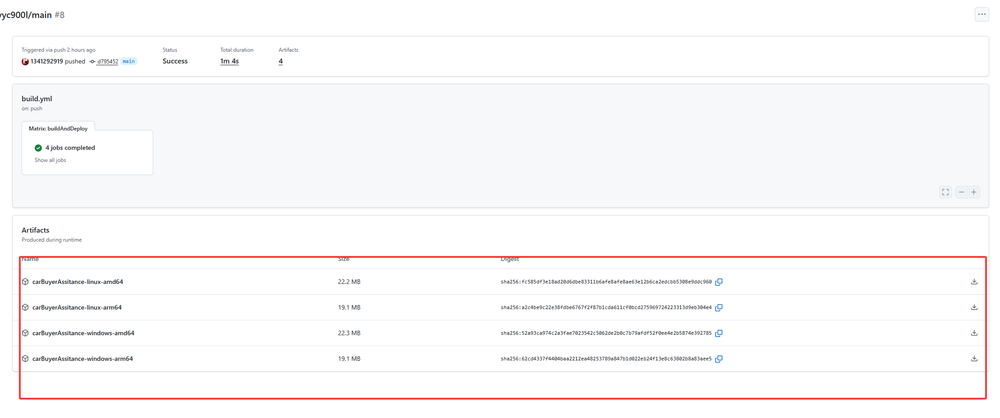
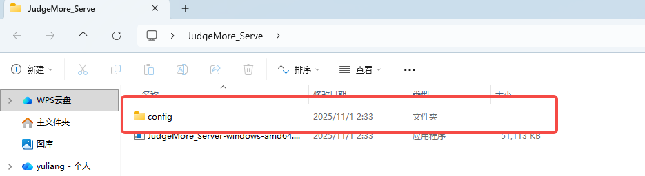

## **CarBuyerAssitance_Server**

github仓库地址：[仓库](https://github.com/1341292919/CarBuyerAssitance_Server)

项目在作为作业接受检查时 后端项目已部署到服务器。可以联系项目组长获取ip。


以下给出启动方案：

### 启动方案

提前声明：项目基于golang开发，后端项目依赖于mysql 如需运行调试，请确保正确配置mysql且正确建表！！

首先可在[github工作流](https://github.com/1341292919/CarBuyerAssitance_Server/actions/runs/19287544284)内找到已经编译的可执行文件。



运行前请确保正确开启mysql 以及完成 [config/config.yaml](https://github.com/1341292919/CarBuyerAssitance_Server/blob/main/config/config.yaml)

类似于下图



以下是具体配置

```yam
mysql:   #mysql的配置
  addr: 0.0.0.0:3306
  database: carBuyerAssitance
  username: carBuyerAssitance
  password: carBuyerAssitance
  charset: utf8mb4


openai:  #既然是ai项目 这个肯定要会配置
  api-key: ""
  api-url: ""
  api-model: ""


services:
  main:
    name : main
    load-balance: true
    addr:
      - 0.0.0.0:9999 #后端项目运行将占用的端口号
```


